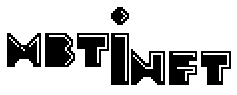
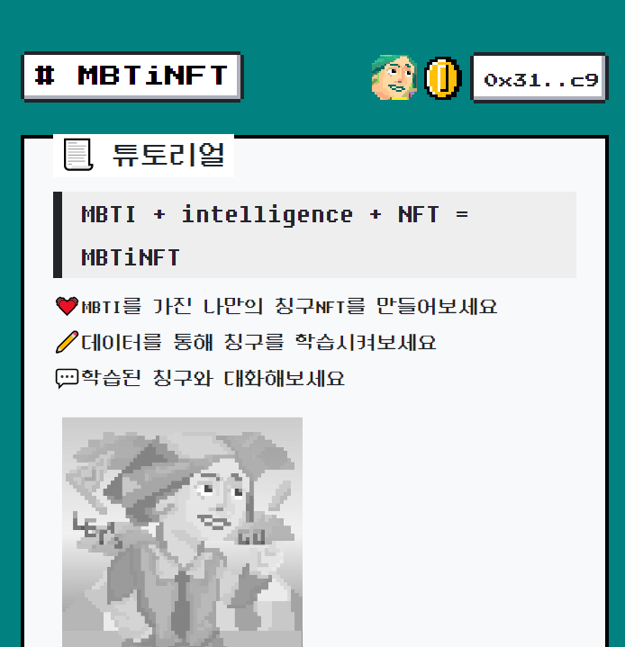

# 

## :eyes: Frontend of MBTiNFT

## References
### Framework
* [Bootstrap 5](https://getbootstrap.com/docs/5.1/getting-started/introduction/) `MIT license`
* [NES.css](https://nostalgic-css.github.io/NES.css/) `MIT license`
* [BOOTSTRA.386](https://github.com/kristopolous/BOOTSTRA.386) `Apache-2.0 License`

### Font
* [둥근모꼴+Fixedsys](https://cactus.tistory.com/193) `Open Font License`
* [Press Start 2P](https://fonts.google.com/specimen/Press+Start+2P) `Open Font License`

## License
Apache-2.0 License